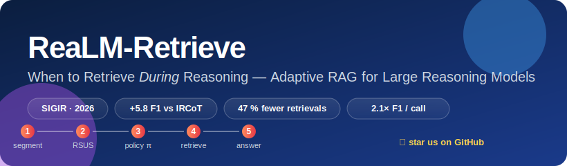

<div align="center">



# ReaLM-Retrieve

### When to Retrieve **During** Reasoning — Adaptive RAG for Large Reasoning Models

<p>
  <a href="https://github.com/bettyguo/realm-retrieve/actions/workflows/ci.yml"></a>
  <a href="https://github.com/bettyguo/realm-retrieve/blob/main/LICENSE"></a>
  <a href="https://www.python.org/downloads/release/python-3110/"></a>
  <a href="https://pytorch.org/"></a>
  <a href="https://doi.org/10.1145/3805712.3809722"></a>
  <a href="https://colab.research.google.com/github/bettyguo/realm-retrieve/blob/main/notebooks/01_quickstart.ipynb"></a>
  <a href="https://github.com/bettyguo/realm-retrieve/stargazers"></a>
</p>

<p>
  <a href="#-quickstart">⚡ Quickstart</a> ·
  <a href="#-results">📊 Results</a> ·
  <a href="#-how-it-works">🧠 How it works</a> ·
  <a href="#-installation">📦 Install</a> ·
  <a href="docs/">📖 Docs</a> ·
  <a href="#-citation">📝 Cite</a>
</p>

</div>

---

> **TL;DR** — Large reasoning models (DeepSeek-R1, o1, QwQ) think for thousands of tokens before answering. Classic RAG retrieves *once*, up front. ReaLM-Retrieve learns **where inside the chain of thought** retrieval actually helps, and skips the rest. The result: **+5.8 F1** on MuSiQue, **47 % fewer retrieval calls**, and a **2.1×** better accuracy-per-call ratio than IRCoT.

<table>
<tr>
<td width="50%">

#### 🎯 What it solves
Long-form reasoning generates **knowledge gaps mid-stream**. Retrieving once is too early; retrieving every sentence is wasteful. ReaLM-Retrieve detects the gaps *as they appear* and intervenes only when external evidence is likely to flip the next step.

</td>
<td width="50%">

#### 🧪 Why it works
A learned policy combines **three uncertainty signals** — verbalised self-assessment, entity-coverage entropy, and consistency across sampled continuations — into a single per-step score, then is fine-tuned with REINFORCE against an F1 / cost reward.

</td>
</tr>
</table>

---

## ⚡ Quickstart

A **2-minute, CPU-friendly toy run** so you can see the pipeline end-to-end without renting an A100:

```bash
git clone https://github.com/bettyguo/realm-retrieve.git
cd realm-retrieve
pip install -e ".[dev]"
make quickstart            # runs examples/quickstart.py on a toy 5-question corpus
```

Output (truncated):

```
[1/5] Question: Which country hosted the 2008 Summer Olympics?
      RSUS=0.18  →  policy = SKIP  (no retrieval)
      Answer: China                            ✓
[2/5] Question: What's the capital of the country that...
      RSUS=0.72  →  policy = RETRIEVE  (top-5 docs, 4.1 ms)
      Answer: Stockholm                        ✓
─────────────────────────────────────────────────
  EM 80.0  |  F1 86.7  |  retrievals/q 1.6  |  F1/call 54.2
```

Prefer notebooks?  → [**Open in Colab**](https://colab.research.google.com/github/bettyguo/realm-retrieve/blob/main/notebooks/01_quickstart.ipynb)
Prefer Docker?     → `docker run --rm -it ghcr.io/bettyguo/realm-retrieve:latest make quickstart`

---

## 📊 Results

### Main benchmark — MuSiQue (multi-hop QA, DeepSeek-R1-32B)

| Method               | EM       | F1       | Retrievals/q | F1 / call |
|----------------------|---------:|---------:|-------------:|----------:|
| No retrieval         | 41.2     | 48.7     | 0.0          |     —     |
| Single RAG           | 52.6     | 59.4     | 1.0          | 59.4      |
| IRCoT                | 58.3     | 65.4     | 3.4          | 19.2      |
| FLARE                | 55.1     | 62.3     | 2.8          | 22.3      |
| Self-RAG †           | 54.8     | 61.9     | 2.1          | 29.5      |
| Search-R1            | 59.1     | 66.8     | 2.4          | 27.8      |
| **ReaLM-Retrieve**   | **63.5** | **71.2** | **1.8**      | **39.6**  |

<sub>† Llama-2-13B base. All gains over IRCoT/Search-R1 significant at *p < 0.01* (paired bootstrap, 10K iter, Bonferroni-corrected).</sub>

### Generalisation across benchmarks

| Dataset      | F1 (Δ vs. IRCoT) | Retrievals/q (Δ vs. IRCoT) |
|--------------|-----------------:|---------------------------:|
| MuSiQue      |  **71.2 (+5.8)** |  **1.8 (−47 %)**           |
| HotpotQA     |  **78.4 (+3.1)** |  **1.4 (−51 %)**           |
| 2WikiMHQA    |  **74.9 (+4.7)** |  **1.6 (−43 %)**           |

Reproduce: `make eval DATASET=hotpotqa`. Full numbers + ablations are in [§5 of the paper](paper/).

---

## 🧠 How it works

```
                ┌─────────────────────────────────────────┐
                │             user question               │
                └──────────────────┬──────────────────────┘
                                   ▼
              ┌────────────────────────────────────────────┐
              │   Large Reasoning Model (DeepSeek-R1 …)    │
              │       generates extended chain-of-thought  │
              └──────────────────┬─────────────────────────┘
                                 ▼
            ① ReasoningStepSegmenter   (94.2 F1 boundary classifier)
                                 ▼
            ② RSUS  =  α·U_verb + β·U_ent + γ·U_cons     ◀──── per step
                                 ▼
            ③ π(retrieve | state)        (REINFORCE policy, λ-curriculum)
                                 ▼
            ④ ColBERTv2 + PLAID retrieval  →  context fusion
                                 ▼
                        final answer
```

| Component                | Where                                            | What it does                                                  |
|--------------------------|--------------------------------------------------|---------------------------------------------------------------|
| **Segmenter**            | [segmentation.py](src/realm_retrieve/models/segmentation.py) | Splits a reasoning chain into logical steps (avg 127 tok).    |
| **RSUS calculator**      | [rsus.py](src/realm_retrieve/models/rsus.py)     | 3-signal step-level uncertainty score.                        |
| **Policy network**       | [policy.py](src/realm_retrieve/models/policy.py) | 4-layer transformer; binary retrieve vs. continue.            |
| **Retriever**            | [retriever.py](src/realm_retrieve/models/retriever.py) | ColBERTv2 + PLAID late-interaction search.                    |
| **LRM adapter**          | [reasoning_model.py](src/realm_retrieve/models/reasoning_model.py) | Unified API for DeepSeek-R1, o1, QwQ.                         |

---

## 📦 Installation

### Minimal (CPU, toy demo)
```bash
pip install -e ".[dev]"
python -m spacy download en_core_web_sm
```

### Full (GPU, training + serving)
```bash
pip install -e ".[all]"           # serve + api + train + dev + docs
python -m spacy download en_core_web_sm
```

### Docker
```bash
docker build -t realm-retrieve .
docker run --gpus all --rm -it realm-retrieve make quickstart
```

### System requirements

|                  | Toy demo    | Inference  | Full training            |
|------------------|-------------|------------|--------------------------|
| GPU              | none        | 1 × 24 GB  | 8 × A100 80 GB           |
| RAM              | 4 GB        | 32 GB      | 512 GB (ColBERT index)   |
| Disk             | 200 MB      | 50 GB      | 68 GB (data + indices)   |
| Wall clock       | < 2 min     | varies     | ≈ 12.5 days policy RL    |

---

## 🗂 Project layout

```
realm-retrieve/
├── src/realm_retrieve/      # installable package
│   ├── models/              #   segmentation · rsus · policy · retriever · LRM
│   └── evaluation/          #   QA + IR + efficiency + bootstrap
├── configs/                 # Hydra configs (datasets, models, experiments)
├── examples/                # Runnable demos — start here
│   └── quickstart.py        #   end-to-end CPU toy
├── notebooks/               # Colab walk-throughs
├── tests/                   # pytest unit + integration suite
├── docs/                    # mkdocs site
├── paper/                   # SIGIR '26 camera-ready
└── Makefile                 # `make help` for everything
```

---

## 🛠 Common tasks

```bash
make help                      # list every target
make quickstart                # toy CPU demo
make install-dev               # editable install + dev tools + pre-commit
make data                      # download MuSiQue / HotpotQA / 2WikiMHQA + build indices
make train-segmentation        # train the step-boundary classifier
make train-policy              # REINFORCE policy (50 K steps)
make eval DATASET=musique      # evaluate on a benchmark
make lint typecheck test       # local CI
make docs-serve                # browse docs at http://localhost:8000
```

---

## ❓ FAQ

<details>
<summary><b>I don't have 8× A100s. Can I still use this?</b></summary>

Yes. The **policy and segmenter checkpoints are tiny** (≈ 40 MB and 6 MB).
You only need a big GPU for the *reasoning model* itself — and you can swap
in any LRM via the OpenAI / Anthropic adapter, or run DeepSeek-R1-Distill-Qwen-1.5B
locally on a single 24 GB card. See [`docs/inference.md`](docs/inference.md).
</details>

<details>
<summary><b>How does RSUS differ from FLARE's token-probability trigger?</b></summary>

FLARE triggers on single low-probability tokens, which fires constantly during
exploratory reasoning. RSUS aggregates **three orthogonal signals** at the
*step* level (≈ 127 tokens), so it only fires when the model is collectively
uncertain about a *claim*, not just a stylistic word choice.
</details>

<details>
<summary><b>Can I replace ColBERTv2 with my own retriever?</b></summary>

Yes — implement the [`Retriever` protocol](src/realm_retrieve/models/retriever.py)
(`retrieve(query, k) -> List[Dict]`) and inject it via Hydra:
`retrieval.checkpoint=path/to/yours`.
</details>

<details>
<summary><b>Does it work for code, math, or non-English?</b></summary>

The entity-entropy signal needs a NER model — swap `en_core_web_sm` for any
spaCy language model. For code/math, set `β=0` and rely on verbalised +
consistency signals; we report ablations in §6.3 of the paper.
</details>

<details>
<summary><b>How do I cite this work?</b></summary>

See [Citation](#-citation) below or `CITATION.cff` in this repo.
</details>

---

## 🛣 Roadmap

We ship in three-week milestones. Click into any issue for the design sketch
and acceptance criteria — most are scoped tightly enough to land in a single
PR.

### v1.1 — *due 2026-06-11* &nbsp; [milestone](https://github.com/bettyguo/realm-retrieve/milestone/2)
- [ ] [#6](https://github.com/bettyguo/realm-retrieve/issues/6) `chore(types):` modernise type hints to PEP-604 — **good first issue**
- [ ] [#7](https://github.com/bettyguo/realm-retrieve/issues/7) `test(ci):` CPU smoke test that wires the full pipeline from a wheel — **good first issue**

### v1.2 — *due 2026-07-09* &nbsp; [milestone](https://github.com/bettyguo/realm-retrieve/milestone/3)
- [ ] [#8](https://github.com/bettyguo/realm-retrieve/issues/8) `feat(retriever):` extract a `Retriever` Protocol (BM25 · SPLADE · custom) — **help wanted**

### v2.0 — *due 2026-09-03* &nbsp; [milestone](https://github.com/bettyguo/realm-retrieve/milestone/4)
- [ ] [#9](https://github.com/bettyguo/realm-retrieve/issues/9) `research(rsus):` multilingual entity-entropy support (zh / ja / es)
- [ ] [#10](https://github.com/bettyguo/realm-retrieve/issues/10) `feat(demo):` HuggingFace Space + interactive playground

### Recently shipped (v1.0)
- [x] [#1](https://github.com/bettyguo/realm-retrieve/issues/1) Hydra `config_path` corrected
- [x] [#2](https://github.com/bettyguo/realm-retrieve/issues/2) REINFORCE trainer no longer crashes on empty episodes
- [x] [#3](https://github.com/bettyguo/realm-retrieve/issues/3) Heavy imports are lazy → CPU consumers work out of the box
- [x] [#4](https://github.com/bettyguo/realm-retrieve/issues/4) Ship the missing `configs/experiments/*.yaml`
- [x] [#5](https://github.com/bettyguo/realm-retrieve/issues/5) Validate RSUS weights sum to 1

See [all open issues](https://github.com/bettyguo/realm-retrieve/issues) or
the [v1.1 board](https://github.com/bettyguo/realm-retrieve/milestone/2) — and
please open an issue if you hit something unexpected.

---

## 🤝 Contributing

Pull requests are welcome. Please read [CONTRIBUTING.md](CONTRIBUTING.md) for the dev loop and our [Code of Conduct](CODE_OF_CONDUCT.md) before opening a PR. Security-sensitive reports go through [SECURITY.md](SECURITY.md).

---

## 🌟 Stargazers

If ReaLM-Retrieve helps your research, **a ⭐ keeps us going** — it's the single most useful signal we get from the community.

[](https://star-history.com/#bettyguo/realm-retrieve&Date)

---

## 📝 Citation

```bibtex
@inproceedings{guo2026realmretrieve,
  title        = {When to Retrieve During Reasoning: Adaptive Retrieval for Large Reasoning Models},
  author       = {Guo, Dongxin and Wu, Jikun and Yiu, Siu Ming},
  booktitle    = {Proceedings of the 49th International ACM SIGIR Conference on Research and Development in Information Retrieval (SIGIR '26)},
  year         = {2026},
  publisher    = {ACM},
  address      = {Melbourne, Australia},
  doi          = {10.1145/3805712.3809722}
}
```

---

## 📜 License

Released under the [Apache 2.0 License](LICENSE). The SIGIR '26 manuscript in [`paper/`](paper/) is © ACM 2026 and is shared here for non-commercial research use under the conference's open-access terms.

<sub>Built with ❤ at HKU & Stellaris AI. Inspired by IRCoT, FLARE, Self-RAG, and Search-R1.</sub>
